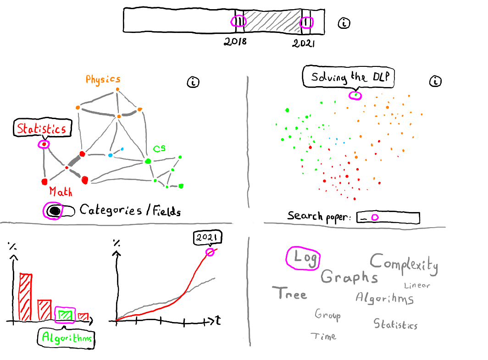
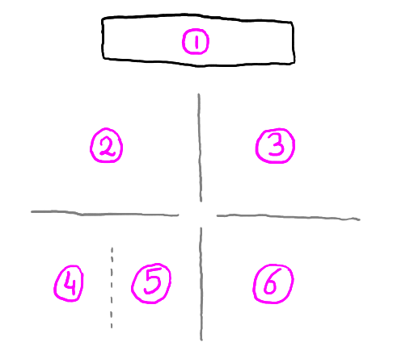
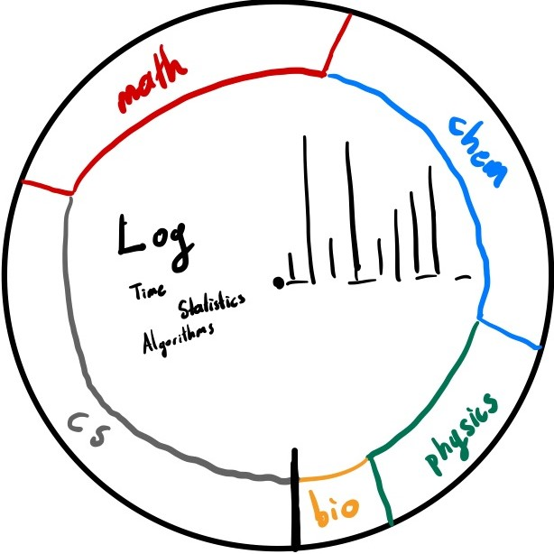

# Project of Data Visualization (COM-480)

| Student's name | SCIPER |
| -------------- | ------ |
| Adina-Maria Ciubotaru | 322497 |
| Florian Cassayre | 269909 |
| Utku Görkem Ertürk | 321977 |

[Milestone 1](#milestone-1) • [Milestone 2](#milestone-2) • [Milestone 3](#milestone-3)

**[https://com-480-data-visualization.github.io/data-visualization-project-2021-ufa](https://com-480-data-visualization.github.io/data-visualization-project-2021-ufa)**

## Milestone 1 (23rd April, 5pm)

**10% of the final grade**

This is a preliminary milestone to let you set up goals for your final project and assess the feasibility of your ideas.
Please, fill the following sections about your project.

*(max. 2000 characters per section)*

### Dataset

For our project, we decided to work on the [arXiv dataset](https://www.kaggle.com/Cornell-University/arxiv). This dataset contains metadata of all the 1.7 million articles uploaded on arxiv.org. The metadata in this dataset consists mainly of the following fields: title, abstract, authors list, categories, upload date and doi. From our exploratory data analysis work, we concluded that the dataset is of great quality: for most use cases the data is ready to be used right away. For text analysis tasks, a standard tokenization pipeline shall be applied in order to filter our symbols and other non-textual notations.

Remark: Anyone can publish articles on arXiv. For this project, we assume that most of the articles are serious, and thus that our analysis will be negligibly affected by nonsensical data. This information will be indicated in our final visualization.

### Problematic

In our project, we are interested in presenting an insightful analysis of the trends in academic publications. In particular, we will be providing an intuitive tool to explore the complex and immense space of scientific publications.

We are aiming to target two audiences jointly:
- One of them is the general public: the public doesn't always have a clear idea of how research works. With this project, we are hoping to provide them an engaging overview of the academical world, and a taste of how researchers collaborate together to create scientific results.
- The other target are academics people in general (researchers, students, ...): we reserve them more advanced tools that will allow them to get a deeper insight of the data; for instance visualizing the topics that are subject to active research, the transversality of the different fields, and more.

### Exploratory Data Analysis

Please refer to the following notebook: [`python/exploratory_data_analysis.ipynb`](python/exploratory_data_analysis.ipynb).

Our preliminary analysis served different purposes. First off, it allowed us to assess the data, evaluate how much preprocessing work was required before we could get started. In our case, the data required very little preprocessing, and we could get started right away. The second purpose was to validate the feasibility of our ideas; that is to verify that the data was rich enough, and that we could extract the patterns we wanted. 

The analysis we conducted includes several interesting tracks of research. We started simply by studying global indicators such as the number of papers published over time, the preferred day of the week for publishing, number of categories, etc. Curiously, we observed that the character length of both the title and the abstract was gradually and significantly increasing. Also, it seems that the authors are collaborating in larger groups for a single paper.
Unsurprisingly we also observed that the vocabulary and wording of the title and of the abstract were highly correlated to the category in which the paper was uploaded. Finally, we studied the transversality of the categories and made compelling observations.

In addition we initially wanted to also orient our analysis towards the EPFL research community (how researchers at EPFL collaborate together). However as our results were partly inconclusive, we decided to discard it.

### Related work

This dataset was initially posted on Kaggle and intended to be used for machine learning purposes; main use cases include training text analysis models such as word2vec to find the similarities between papers, and topic classification.
We found a relevant literature that studied scholar data, although the scope is different than ours; [A Survey of Scholarly Data Visualization](https://www.researchgate.net/publication/323715703_A_Survey_of_Scholarly_Data_Visualization). We couldn't find a major project that perform data analyses similar to the ones we performed. Thus we concluded that our approach was original.

Our main source of inspiration for this project comes from our personal experience, and to a lesser extent from the data visualization stories showcased during the lectures.

As an extra note, we didn't use this dataset before.

## Milestone 2 (7th May, 5pm)

**10% of the final grade**

The latest version is automatically built and made available on GitHub pages:
**[https://com-480-data-visualization.github.io/data-visualization-project-2021-ufa](https://com-480-data-visualization.github.io/data-visualization-project-2021-ufa)**

### Core Ideas

  
  

While all the parts can be treated separately, they will interact with each other to produce a rich user experience. We describe their behaviors below.

#### Introduction modal (0)

When the user lands on the page, a modal will pop up to briefly explain our motivation and the goals of the visualization. This allows us to restrict the amount of textual description to a minimum, and provide more space to the graphics.

#### Time slider (1)

A slider input that enables the user to select a year range.

#### Weighted graph of all categories (2)

A weighted graph of all categories, with edges proportional to the number of papers having the two categories at the same time. The graph evolves depending on the selected time period. One category can be selected by clicking on it. Each category is colored according to its parent _field_ of study.

#### Cloud of points representing the papers individually (3)

A cloud of points representing the papers individually, which position were determined using PCA on the title/abstract. Papers are highlighted only if they fall in the selected time range, and are either of the selected category, or the *hovered* one. Moreover, you can explore the papers either by searching or clicking one of the points.

#### Bar chart of similar categories (4)

A bar plot that shows the weighted proportion of categories related to the selected category on the graph. It will be only shown up to N similar categories to eliminate clustering and information noise. We are using the same color code as in the weighted graph for the bars.

#### Line chart of papers published (5)

A line plot that shows the proportion of papers published in this category per time interval. If a time period is selected then the chart will be scaled for that period of time. A baseline will be included for comparison.

#### Cloud of most used keywords (6)

Ranking of most used keywords in selected category or paper in this time period. It might not necessarily be a cloud of tags as we are still investigating other possibilities to display this information.

### Extra Ideas

#### Chord diagram

The user will be able to switch between visualizing the categories or the fields (2), for a finer granularity control. Categories are displayed as a force-directed graph, while fields will be displayed as a chord diagram. The other plots will nicely adapt to this change.

#### Multiple selection

Besides hovering the user should be able to select an arbitrary number of categories at the same time, in order to compare them against each other.

All of our graphs will adapt to multiple selection and chord diagram.

- Cloud of points will highlight the currently selected categories.
- Bar chart will consider the aggregation of all of the selected categories.
- Line chart will use the average of selected categories.
- Cloud of keywords will display the most frequent keywords among selected categories.

#### Alternative visualization for secondary graphs (4, 5, 6)

  

When the user hovers one of the nodes of the weighted graph, the node will enlarge and transform to the above visualization. This circular graph combines charts (4, 5, 6). The outer ring represents the bar chart of similar categories and the proportion of categories are represented by the length of the bars. Inner bar graph replaces line chart of published papers. From center of the circle to the outer ring, year increases and the length of the bars represents the proportion of the papers published in that year. The remaining space will be used for the cloud of words. This alternative visualization idea makes the representation more compact.

### Tools

All visualizations will be built using **D3.js**, except the cloud of points (the 3rd core idea) which uses **three.js**, for performance reason. We are also using Tailwind for the layout and styling.
Generally speaking, we will make use of the introductory Javascript and D3 lectures. The lecture on *text visualization* will be of particular interest in order to enhance the cloud of tags (the 6th core idea). From the upcoming lectures we expect to discover more creative resources about how to represent our graph of categories (the 2nd core idea) in the lecture about *graphs* and how to deliver our story in a captivating manner in the *storytelling* lecture.

## Milestone 3 (4th June, 5pm)

**80% of the final grade**

## Late policy

- < 24h: 80% of the grade for the milestone
- < 48h: 70% of the grade for the milestone

