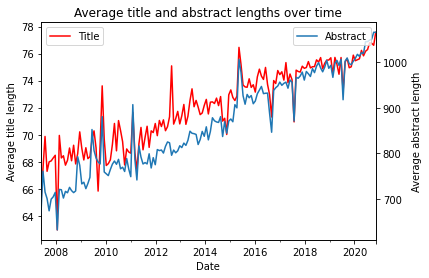

# Initial Idea

Initially we weren't sure what data we wanted to work on. We had several options ranging from transports to internet memes. Until we figured the scientific platform arXiv was publishing their data openly; to which we unanimously agreed. It is a platform hosting scientific papers and articles, which are not peer-reviewed but accessible for free to anyone. The information that was made available in this dataset consisted of the metadata for all the documents submitted since 2007: about 1.8 million entries. Following the choice of the dataset we proceeded to find our project idea around it. We were thinking about connecting the EPFL research community through this data. However upon doing the exploratory data analysis study we realized this idea would be unsuccessful as the data simply wasn't rich enough. This lead us directly to the second idea: we observed that although we often used the platform to access scientific literature, we didn't have an understanding of the data that was present until we actually performed the data analysis ourselves. Therefore we wanted to provide a tool that would provide users an overview of the type of data that was available there.

# Data analysis

The data was surprisingly very clean and little pre-processing was needed. That allowed us to spend time for coming up with interesting patterns in the data. Obviously, as the dataset was relatively large (3 gigabytes) it was certainly a challenge to work with it. We started with general statistics and continued with more sophisticated text analyses.

Among our results we found that the platform had a significant increase in the number of documents uploaded during the year 2020. Or that the users uploaded twice as many time on Wednesdays than on any other weekday. Curiously we also discovered that the number of codepoints in both the titles and the abstracts has been significantly and steadily increasing over time; though we couldn't come up with any rational explanation! Finally we also observed that the number of authors per paper was increasing too.

{ width=300px }

# Data Visualization Idea

{ width=500px }

{ width=200px }

While all the parts can be treated separately, they will interact with each other to produce a rich user experience. We describe their behaviors below.

Our main idea is to show changes(most used words, categories, dominance of categories) throughout time.

### Introduction modal (0)
When the user lands on the page, a modal pops up to briefly explain our motivation and the goals of the visualization. This allows us to restrict the amount of textual description to a minimum, and provide more space to the graphics.

### Information bubbles (0-1)
Information bubles give details of each visualization.

### Time slider (1)
A slider input that enables the user to select among years. We previously proposed that user could select range of years but we realized that computing each visualization in terms of multiple ranges of time is tricky. For example, we should precalculate cloud of points(since pca is computationally intensive) for each possible range.

### Weighted graph of all categories (2)
A weighted graph of all categories, with edges proportional to the number of papers having the two categories at the same time. The graph evolves depending on the selected year. One category can be selected by clicking on it. Each category is colored according to its parent field of study.

### Cloud of points representing the papers individually (3)
A cloud of points representing the papers individually, which position were determined using PCA on the title/abstract. Papers are highlighted only if they fall in the selected year, and are the selected category and selected keyword. Moreover, you can explore the papers clicking one of the points. We are using PCA to see implicit relation between categories/papers. We couldn't  implement search functionality because of the limited time. We added keyword interaction so that only papers that contain selected keyword are highlighted.

### Bar chart of similar categories (4)
A bar plot that shows the weighted proportion of categories related to the selected category on the graph. It will be only shown up to N similar categories to eliminate clustering and information noise. We are using the same color code as in the weighted graph for the bars.

### Line chart of papers published (5)
A line plot that shows the proportion of papers published in this category per time interval. If a year is selected then the chart will be scaled for that year. A baseline(mean) will be included for comparison.

### Cloud of most used keywords (6)
Ranking of most used keywords in selected category in selected year. Words that are used frequently shown in bigger size. We did not implement frequent words for selected paper since we realized it does not contribute our main idea(it is fine-grained detail).

## Future work

We did not implement any of our extra ideas. But this project can be further imporved by implmenting them. So we will also mention here.

### Chord diagram
The user will be able to switch between visualizing the categories or the fields (2), for a finer granularity control. Categories are displayed as a force-directed graph, while fields will be displayed as a chord diagram. The other plots will nicely adapt to this change.

### Multiple selection
Besides selecting only one category the user should be able to select an arbitrary number of categories at the same time, in order to compare them against each other.

All of our graphs will adapt to multiple selection and chord diagram.

- Cloud of points will highlight the currently selected categories.
- Bar chart will consider the aggregation of all of the selected categories.
- Line chart will use the average of selected categories.
- Cloud of keywords will display the most frequent keywords among selected categories.

### Alternative visualization for secondary graphs (4, 5, 6)

{ width=200 }

When the user selects one of the nodes of the weighted graph, the node will enlarge and transform to the above visualization. This circular graph combines charts (4, 5, 6). The outer ring represents the bar chart of similar categories and the proportion of categories are represented by the length of the bars. Inner bar graph replaces line chart of published papers. From center of the circle to the outer ring, year increases and the length of the bars represents the proportion of the papers published in that year. The remaining space will be used for the cloud of words. This alternative visualization idea makes the representation more compact.

# Moving to the web

## Workflow

We invested some time preparing a good development environment in order to be as efficient as possible afterwards. First of all instead of relying on CDNs or minified dependencies we used the [npm](http://npmjs.org/) package manager. Among the packages that we used are:

- **webpack**: compiles all the scripts and styles into a single, minified bundle. Provides convenient tools for development such as hot reloading
- **babel**: transpile JavaScript code to a different version for compatibility between browsers. This allowed us to write high level ES6 code without having to worry about the portability
- **sass**: an extension of CSS with extra syntactic features
- **eslint**: a linter for JavaScript to keep the code tidy and agree on a common style
- **tailwind**: a framework that provides classes for styling and reduces the amount of CSS code to be written. Useful for prototyping
- **d3**: a helper library to link data to the DOM. The main use case is data visualizations
- **three**: a high-level 3D library running on WebGL for performant real-time rendering

Together they enabled us to set an automatic workflow on [GitHub Actions](https://github.com/features/actions) to verify the code (syntax, style, warnings), create a bundle and deploy it on [GitHub Pages](https://pages.github.com). This process was triggered on every commit pushed to the main branch and everyone could access the latest version live without having to build it on their side.

A Python script performs the data generation. It takes the dataset as an input and computes all the json files that are needed by the frontend. Thanks to this workflow anyone can check the transformations that were applied to the data and it also makes it very easy to update the data in case a newer version of the dataset comes out. Additionally there is a caching functionality that make future executions of the script faster (it was very convenient when we were incrementally adding features). In the end, the output data weighs less than 2MiB and thus we are guaranteed that page loads reasonably quickly.

Moreover we used the GitHub ticket system along with a three columns Kanban board to manage the tasks and their progress.

## Implementation

In this section we describe some of the both technical and design challenges that we encountered during the implementation.

The first item is about the layout of the page and the alignment of the elements. We considered both multi-page and single-page designs. We quickly realized that single page design was convenient for a user to see all of the statistics and results of interactions in one place. On the other hand it was challenging to fit all of the visualizations on a single page with a meaningful placement while ensuring it displays properly on different screen sizes. To do so we divided our visualization into six different parts. We placed them such that the mental model of the user matches with the actions that we implemented. The timeline is placed on top of the screen. This placement indicates that time is the main variable. In the second row, we placed the category graph and the cloud of papers which show different interpretations of the papers. The smaller plots related to the category graph are placed right below it. The word cloud is placed at the bottom right corner since it is linked to the category graph and the cloud of papers.

The next item regards the cloud of papers. Our first idea was to show all of the papers that correspond to selected variables on cloud of papers. However, we realized that rendering all the papers as a point was going to be computationally expensive since there would more than a million. To overcome this problem, we used the three.js library which relies on WebGL to take advantage of hardware acceleration. In addition we only render a (random) subset of 25,000 papers, which turned out to be a reasonable tradoff.

The graph uses a force-directed layout to minimize the distance of the edges and thus group the nodes together in a meaningful way. We also encountered performance issues with this visualization. Despite having only 179 nodes (for each category), the number of edges was close to the square of that which is in the tens of thousands. The bottleneck was not coming from the force simulation but rather the rendering itself (especially with the transparency properties). We noticed that the vast majority of edges was of very low weight, and practically invisible when displayed. Thus we chose to hide these low weight edges and the performance improved right away. Moreover any node that was not connected to the main graph was filtered out.

We also had to think about how to link the different interactions together. We went with an centralized approach were each component is aware of its neighbours and updates them as needed.

Finally, to make our website available for various devices, we designed and implemented all of our components in a responsive way. So that depending on the screen size, components will be adjusted as best as possible.

# Conclusion

This project allowed us to sharpen our web development and data analysis skills. In the end our final visualization resembles very closely to the ideas we had sketched on paper, and we are satisfied about it. We didn't implement all the bonus features we had planned, but we found other cool ideas to integrate and some aspects turned out better than expected.

# Self-Assessment

**Adina-Maria Ciubotaru**: Page layout, landing modal, infobubbles and plot tooltips.

**Florian Cassayre**: Data generation, cloud of papers and wordcloud, and responsible for gluing the different elements together.

**Utku Görkem Ertürk**: Timeline, visualization baseline of category graph, bar and time plots.
